# 从零实现 C-- 编译器前端（系列教程）

> 面向有 C++ 基础、想亲手做一个小编译器的自学者。本系列用真实项目串联编译原理，每章遵循：**理论 → 产物 → 代码 → 验证**。

---

> 博客地址：https://blog.csdn.net/2301_78617751/article/details/161483965?spm=1001.2014.3001.5502

## 写在前面

### 编译器前端是什么？

完整编译器通常分为 **前端** 和 **后端**：

- **前端**：读懂源语言——词法分析、语法分析、语义分析，产出与机器无关的中间表示（IR）
- **后端**：针对具体 CPU 做优化、生成汇编/机器码

本系列只做到前端：把 `.sy` 源文件变成 LLVM IR（`.ll` 文件）。你不需要先读完 500 页教材；跟着做、对照输出，再回头补理论，效率更高。

### C-- 是什么？

C-- 是本实验的源语言，可以理解为 **C 语言的精简子集**：

- 单文件，后缀 `.sy`
- 支持：`int` / `float`、变量与 `const`、函数、`if-else`、`return`、四则与逻辑运算
- **不支持**：`#include`、`#define`、指针、`struct` 等

示例（也是全系列贯穿的 `test1.sy`）：

```c
int main ( ) {
  int a = 1 , b = 2 ;
  a = a + b - 1 ;
  if ( a == 2 ) {
    return 0 ;
  } else {
    b = b * 2 / 1 % 2 ;
    return 1 ;
  }
}
```

### 三阶段路线

整个前端分三步完成，**每一步的产物是下一步的输入**：

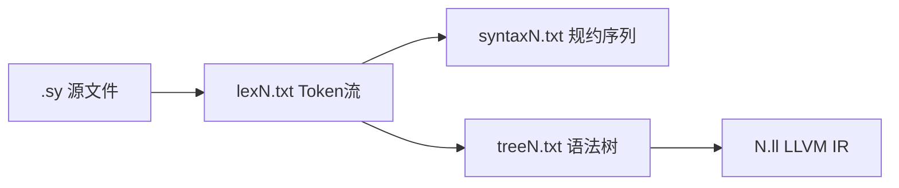


| 阶段   | 目录            | 输入              | 输出                          | 在编译器中的角色   |
| ---- | ------------- | --------------- | --------------------------- | ---------- |
| 一、词法 | `lex/`        | `test/testN.sy` | `output/lexN.txt`           | 把字符流切成「单词」 |
| 二、语法 | `Syntax/`     | `lexN.txt`      | `syntaxN.txt` + `treeN.txt` | 检查句子结构，建树  |
| 三、IR | `complie_ir/` | `treeN.txt`     | `output/N.ll`               | 按树生成中间代码   |


### 环境准备

**需要**：C++编译器（g++）、可运行 `build.bat`（Windows）或 `make`（Linux/Mac）。

```batch
# 项目根目录 Finallab/
./build.bat    # 编译词法器 + 语法器
./run.bat      # 批量跑 test0~test8
```

本实现 **不使用** Lex/Yacc、ANTLR 等工具，自动机、SLR 表、Visitor 均为手写，便于理解原理。

### 如何阅读本系列

1. 先看当章「编译原理在说什么」
2. 运行或打开对应 **产物文件**，对照源程序理解格式
3. 阅读 **关键代码片段**（仓库内路径已标注）
4. 按文末命令 **自己跑一遍**

阶段二、三正文将在后续篇章补全；本文完整覆盖 **阶段一：词法分析器**。

---

## 阶段一：词法分析器

### 1.1 编译原理视角：词法分析在做什么？

源程序本质是 **字符序列**。词法分析器（Lexer / Scanner）的第一项工作，是按语言规则把它切成一个个 **单词符号（Token）**，例如：

```
int a = 10;
```

会被切成：`int`、`a`、`=`、`10`、`;` 五个 Token。

**词法 vs 语法**（先建立直觉）：


|       | 词法分析       | 语法分析            |
| ----- | ---------- | --------------- |
| 识别对象  | 单词         | 句子结构            |
| 常用模型  | 正则 → 有限自动机 | 上下文无关文法 → 下推自动机 |
| 本系列产物 | `lexN.txt` | `treeN.txt`     |


词法错误示例：源程序里出现 `@`、`&` 等 C-- 未定义的字符。词法器应报告 **行号、列号**，并尽量让后续阶段继续（本项目的语法器会跳过 `ERROR` Token）。

### 1.2 自动机理论：NFA → DFA → 最小化

课本里常写「正则表达式 → NFA → DFA」。本项目的实际流程是：

```
手工预置 NFA  →  子集构造(NFA→DFA)  →  简化最小化  →  用 DFA 扫描源文件
```

#### 有限自动机 FA

自动机由 **状态** 和 **转移** 组成：读入一个符号，从当前状态跳到下一状态；若进入 **终态**，表示识别到某一类 Token。

项目中用结构体 `FA` 统一表示 NFA 和 DFA：

```cpp
// lex/Lex_Analysis.cpp
typedef struct trans_map {
    char rec;   // 输入符号；'@' 表示 ε 转移
    int now;
    int next;
} transform_map;

typedef struct finite_automata {
    vector<char> input_symbols;
    set<int> states;
    map<int, string> state_labels;  // 终态 label：INT / SE / OP / I&K / FLOAT 等
    set<transform_map> trans_map;
    set<int> start;
    set<int> final;
} FA;
```

#### 预置 NFA（手工五元组）

NFA 的状态、边、终态写在全局表里，**不是**运行时从正则自动生成的。字母表做了抽象，便于一张图覆盖多类 Token：


| 符号  | 含义              |
| --- | --------------- |
| `n` | 数字              |
| `l` | 字母              |
| `o` | 运算符 `+ - * / %` |
| `s` | 界符 `(){};,`     |
| `@` | ε 空转移           |


```cpp
// 预置 NFA 片段（完整表见 Lex_Analysis.cpp:94-99）
vector<char> lex_input_symbols = {'n','l','o','s','_','0','=','>','<','!','&','|','-','.'};
set<int> lex_start = {17};
set<int> lex_final = {13, 14, 15, 16, 18, 20};
// lex_trans_map 中 '@' 开头的边即 ε 转移
```

**NFA/DFA 示意**（简化，仅展示核心思路；完整预置表见 `Lex_Analysis.cpp:94-99`）：

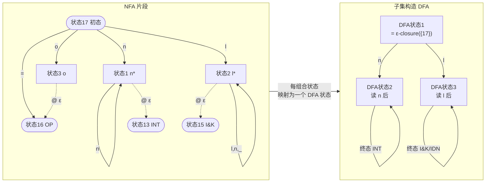

图中 `@` 表示 ε 转移：例如从「读数字的路径」无需再读字符即可到达 INT 终态。子集构造把 NFA 的 **状态集合** 合并为 DFA 的 **单个状态**，扫描时在 DFA 上转移即可。

#### ε-闭包与子集构造

**ε-闭包**：从状态集合出发，沿所有 ε 边能到达的状态一并加入。

```cpp
set<int> getClosure(const set<int> &current_states, const FA &NFA) {
    set<int> closure = current_states;
    set<int> worklist = current_states;
    while (!worklist.empty()) {
        int state = *worklist.begin();
        worklist.erase(worklist.begin());
        for (const auto &tm : NFA.trans_map) {
            if (tm.rec == '@' && state == tm.now && closure.insert(tm.next).second)
                worklist.insert(tm.next);
        }
    }
    return closure;
}
```

**子集构造**（`NFAdeterminization`）：NFA 的「一组状态」对应 DFA 的一个状态；对每个输入符号，用 `getNextState` 转移后再求闭包。若新状态集未出现过，分配新 ID 并加入队列。核心循环见 `Lex_Analysis.cpp:151-205`。

#### DFA 最小化（简化版）

完整 Hopcroft 算法按等价类不断细分。本项目 `minimize()` 只做 **两分区**：非终态一组、终态一组，再重编号。对教学 demo 足够，状态数可能不是理论最小。

#### 扫描时的两个实用规则

1. **最长匹配**：已进入终态时，若下一个字符还能继续转移，则先不输出，继续吃字符（例如 `==` 不能拆成两个 `=`）。
2. **字符分类** `GetCharType`：把源码中的 `a`、`+`、`(` 等映射到 NFA 字母表上的 `l`、`o`、`s` 等（`Lex_Analysis.cpp:280-299`）。

**`==` 最长匹配示意**（超前看 lookahead）：

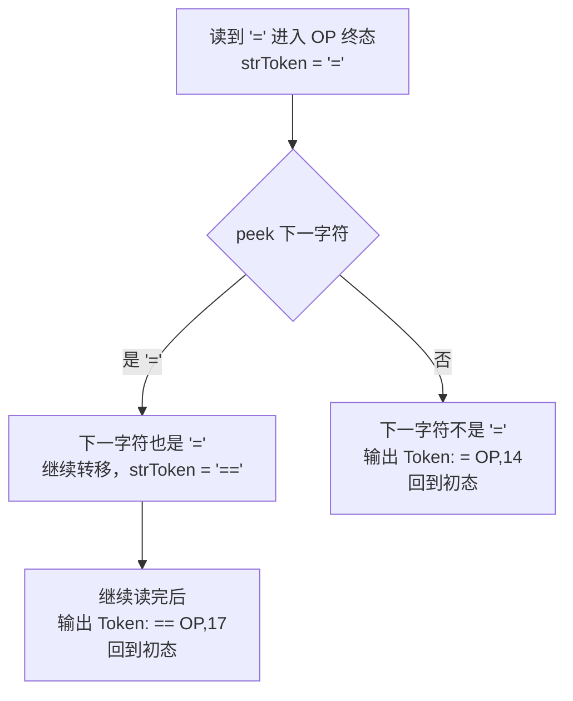

若没有超前看，`a == 2` 会被错误切分为两个 `<OP,14>`，语法阶段无法识别 `==` 比较运算。

### 1.3 项目实现：符号表与 Token 输出

#### 符号表与编号

关键字、运算符、界符在 `**token_code`** 中映射到固定编号 1–28（与课程要求一致）。关键字 **不区分大小写**（`VoID` → `void`）。

```cpp
map<string, int> token_code = {
    {"int", 1}, {"void", 2}, {"return", 3}, {"const", 4}, {"main", 5},
    {"float", 6}, {"if", 7}, {"else", 8},
    {"+", 9}, {"-", 10}, /* ... */
    {"(", 23}, {")", 24}, {"{", 25}, {"}", 26}, {";", 27}, {",", 28}
};
```

到达终态后，`Get_Tokens` 根据终态 label 拼出作业要求的字符串：

```cpp
string Get_Tokens(int state, string strToken, FA DFA) {
    if (DFA.state_labels[state] == "INT")
        return "<INT," + strToken + ">";
    if (DFA.state_labels[state] == "SE") {
        auto it = token_code.find(strToken);
        return "<SE," + to_string(it->second) + ">";
    }
    if (DFA.state_labels[state] == "I&K") {
        string lowerToken = toLowerCopy(strToken);
        if (symbols_table.count(lowerToken) && symbols_table[lowerToken] == "KW")
            return "<KW," + to_string(token_code[lowerToken]) + ">";
    }
    return "<IDN," + strToken + ">";  // 标识符
}
```

#### 扫描主循环（最长匹配 + 超前看）

`lexcial()` 逐行读源文件，跳过空格/Tab，在 `minDFA` 上转移。核心逻辑：

- 每读一字符，经 `GetCharType` 后查转移表
- 若当前为终态，**向前看** 下一字符是否还能转移；不能则输出 Token 并回到初态
- 无法转移且非终态 → 输出 `<ERROR,行号,列号>`

```cpp
void lexcial(const char *address, FA DFA, string x) {
    // 打开 test/testN.sy，写入 output/lexN.txt
    while (getline(Test_sample, buf)) {
        lineNumber++;
        int current_state = *DFA.start.begin();
        string strToken = "";
        for (int i = 0; i < buf.length(); i++) {
            // 跳过空白 ...
            char ch_type = GetCharType(ch, next_ch);
            // 在 DFA.trans_map 中找 (current_state, ch_type) 的转移
            if (DFA.final.count(current_state)) {
                // 超前搜索：下一字符无法继续则输出 Token
                if (!DFA.final.count(next_state)) {
                    record_tokens << strToken << "\t" << Get_Tokens(...) << endl;
                    current_state = *DFA.start.begin();
                    strToken = "";
                }
            }
            // 非法字符 → <ERROR,行,列>
        }
    }
}
```

完整实现见 `lex/Lex_Analysis.cpp:382-550`。

#### 流水线入口

```cpp
void lexical_analysis() {
    FA NFA, DFA, minDFA;
    NFA.input_symbols = lex_input_symbols;
    NFA.start = lex_start;
    NFA.final = lex_final;
    NFA.trans_map = lex_trans_map;
    NFA.state_labels = lex_state_labels;

    DFA = NFAdeterminization(NFA);
    minDFA = minimize(DFA);

    lexcial("test/test1.sy", minDFA, "1");
    // ... test0 ~ test8
}
```

### 1.4 产物解读：`lexN.txt` 格式

**格式**（每行一个 Token）：

```
词素文本[TAB]<种别, 属性>
```

对 `test1.sy` 开头几行，词法器输出 `lex/output/lex1.txt`：

```
int	<KW,1>
main	<KW,5>
(	<SE,23>
)	<SE,24>
{	<SE,25>
int	<KW,1>
a	<IDN,a>
=	<OP,14>
1	<INT,1>
,	<SE,28>
b	<IDN,b>
```

**如何读这一行** `a	<IDN,a>`：

- 词素文本：`a`（源程序里出现的字符串）
- 种别：`IDN`（标识符）
- 属性：名字本身 `a`（不是编号，标识符/常量的属性就是字面值）

**对照源程序**：


| 源程序片段                 | Token 序列（节选）                                           |
| --------------------- | ------------------------------------------------------ |
| `int main ( )`        | `int<KW,1>` `main<KW,5>` `(<SE,23>` `)<SE,24>`         |
| `int a = 1 , b = 2 ;` | `int` `a` `=` `1` `,` `b` `=` `2` `;`                  |
| `if ( a == 2 )`       | `if` `(` `a` `==` `2` `)` — 注意 `==` 是 **一个** `<OP,17>` |


**错误 Token**（如 `test0.sy` 含非法字符）：

```
^	<ERROR,4,5>
```

表示第 4 行第 5 列有无法识别的字符。阶段二的语法器会记录错误并 **跳过** 该 Token，尽量继续分析后续代码。

**这份文件对下一阶段意味着什么？**

语法分析器 **不读** `.sy` 源文件，只读 `lexN.txt`。每一行被解析为一个内部 `Token`，再映射为文法终结符（如 `<KW,1>` → `SYM_KW_INT`）。因此 `lexN.txt` 就是语法分析的 **输入字母表实例化**。

### 1.5 动手验证与常见坑

**编译运行**（在 `lex/` 目录下）：

```powershell
cd lex
g++ Lex_Analysis.cpp -o Lex_Analysis -std=c++17
./Lex_Analysis
# 生成 output/lex0.txt ~ lex8.txt
```

**对照参考答案**（若有）：

```powershell
# 例如 test1
fc output\lex1.txt test\test1.ref
```

**常见坑**：


| 现象             | 可能原因                             |
| -------------- | -------------------------------- |
| `==` 被拆成两个 `=` | 未实现最长匹配/超前看                      |
| `main` 被标成 IDN | 关键字表或 `I&K` 终态判断错误               |
| `VoID` 无法识别    | 未对关键字做小写转换                       |
| 浮点 `3.14` 失败   | `.` 与数字的转移未接好                    |
| 输出路径不对         | 需在 `lex/` 下运行，或检查 `output/` 是否创建 |


说明：`processed_symbols_table` 在扫描时收集符号，**不会**写入 `lexN.txt`；作业提交以 Token 文件为准。

### 1.6 阶段小结与下一阶段预告

**你应掌握**：

1. 词法分析在编译流水线中的位置：字符流 → Token 流
2. NFA、DFA、ε-闭包、子集构造的含义
3. 本项目用 **预置 NFA + 确定化 + 简化最小化** 得到扫描器
4. `lexN.txt` 每行的格式，以及它如何作为语法分析输入

**下一阶段（语法分析）将回答**：

- 如何用 SLR 表判断 `int a = 1 , b = 2 ;` 是否合法？
- 归约序列 `syntaxN.txt` 里 `move` / `reduction` 是什么意思？
- 语法树 `treeN.txt` 的缩进结构如何对应 AST？

---

## 阶段二：语法分析器

> 阶段一的产物 `lexN.txt` 是本章输入；本章产出 `syntaxN.txt`（规约序列）和 `treeN.txt`（语法树），供阶段三生成 IR。

### 2.1 从 Token 流到语法树

词法分析只回答「有哪些单词」。语法分析要回答：**这些单词按什么顺序组合，才构成合法程序？**

例如 `int a = 1 , b = 2 ;` 合法，而 `int = a 1 ;` 不合法——这不是某个 Token 错了，而是 **结构** 错了。

语法分析器的核心任务：

1. 按文法规则检查 Token 序列
2. 输出分析过程（移进 / 归约 / 接受）
3. 构建 **抽象语法树（AST）**，供后续语义分析与 IR 生成使用

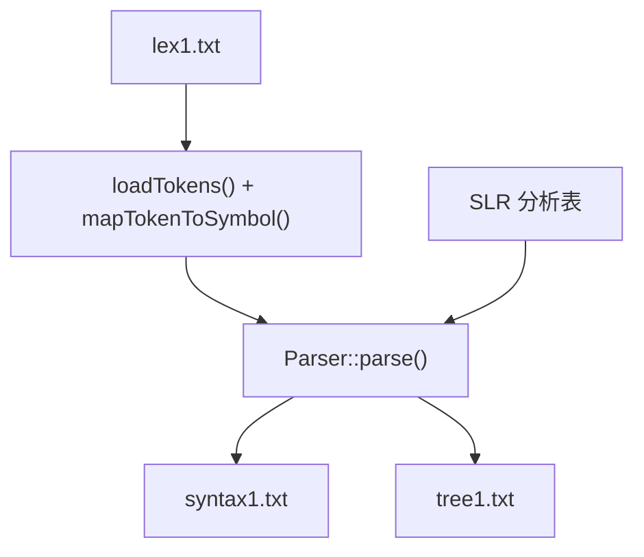


### 2.2 上下文无关文法与 EBNF 展开

C-- 的语法用 **上下文无关文法（CFG）** 描述：一组产生式 `A -> X Y Z`，表示非终结符 `A` 可展开为符号串。

作业附录中的文法使用了 EBNF 扩展符号：


| EBNF 写法 | 含义       | 展开方式                   |
| ------- | -------- | ---------------------- |
| `X`*    | 0 次或多次   | `XList -> XList X | ε` |
| `X?`    | 0 次或 1 次 | `OptX -> X | ε`        |
| `A | B` | 二选一      | 两条产生式                  |


SLR 算法只能处理纯 CFG，因此必须先展开。以编译单元为例：

```
// 原始（EBNF）
compUnit -> (decl | funcDef)* EOF

// 展开后（本项目）
CompUnit  -> UnitList
UnitList  -> UnitList Unit
UnitList  -> ε
Unit      -> Decl
Unit      -> FuncDef
```

**EBNF → CFG 展开对照**（更多规则见 [c--文法.md](../c--文法.md)）：

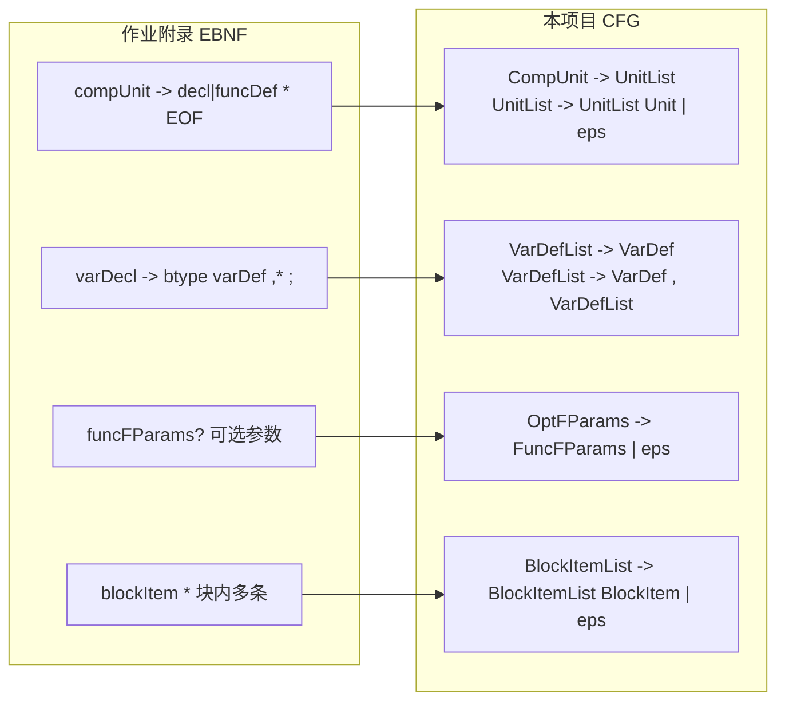

**本项目对原始文法的关键修改**（详见 [c--文法.md](../c--文法.md)）：

1. `**main` 是关键字**：词法输出 `<KW,5>`，文法中 `FuncName -> ID | KW_MAIN`
2. **逗号列表**：`VarDefList -> VarDef , VarDefList`，避免 FOLLOW 传播问题
3. **函数定义**：`int`/`float` 函数用 `BType` 开头，`void` 函数用 `FuncType`，减少归约冲突
4. **Cond 支持括号表达式**：`PrimaryExp -> '(' Exp ')'`，使 `if (a == 2)` 中的条件能完整解析

文法初始化在 `GrammarAnalyzer::initGrammar()` 中，约 80 条产生式：

```cpp
// Syntax/GrammarAnalyzer.cpp
void GrammarAnalyzer::initGrammar() {
    auto add = [&](int left, vector<int> right) {
        productions.push_back({pid++, left, right});
    };
    add(NON_PROGRAM, {NON_COMPUNIT});
    add(NON_COMPUNIT, {NON_UNITLIST});
    add(NON_UNITLIST, {NON_UNITLIST, NON_UNIT});
    add(NON_UNITLIST, {SYM_EPSILON});  // ε 空产生式
    // ...
    add(NON_VARDEF, {SYM_ID});
    add(NON_VARDEF, {SYM_ID, SYM_OP_ASSIGN, NON_INITVAL});
    add(NON_FUNCNAME, {SYM_ID});
    add(NON_FUNCNAME, {SYM_KW_MAIN});  // main 关键字
}
```

### 2.3 符号体系：终结符与非终结符

语法分析器内部用整数 ID 表示所有符号，定义在 `GrammarAnalyzer.h`：

```cpp
enum SymbolType {
    // 0-49: 终结符
    SYM_EPSILON = 0, SYM_EOF, SYM_ERROR,
    SYM_ID, SYM_INT_CONST, SYM_FLOAT_CONST,
    SYM_KW_INT, SYM_KW_VOID, SYM_KW_RETURN, SYM_KW_CONST,
    SYM_KW_MAIN,  // main 是关键字，不是普通 ID
    SYM_KW_FLOAT, SYM_KW_IF, SYM_KW_ELSE,
    SYM_OP_PLUS, SYM_OP_MINUS, /* ... */
    SYM_SE_LPAREN, SYM_SE_RPAREN, /* ... */

    // 50+: 非终结符
    NON_PROGRAM = 50, NON_COMPUNIT, NON_UNITLIST, NON_UNIT,
    NON_DECL, NON_VARDECL, NON_FUNCDEF, NON_STMT, NON_EXP,
    // ...
};
```

**词法 Token 到语法符号的桥梁**在 `main.cpp` 的 `mapTokenToSymbol()`：

```cpp
// Syntax/main.cpp
SymbolType mapTokenToSymbol(string category, int val) {
    if (category == "KW") {
        switch(val) {
            case 1: return SYM_KW_INT;
            case 5: return SYM_KW_MAIN;  // <KW,5> → main 终结符
            // ...
        }
    }
    if (category == "IDN") return SYM_ID;
    if (category == "INT") return SYM_INT_CONST;
    // OP、SE 同理映射到 SYM_OP_* / SYM_SE_*
}
```

读取 `lex1.txt` 时，`loadTokens()` 解析每行 `词素[TAB]<种别,值>`，构造 `Token` 列表，末尾追加 `SYM_EOF`（`$`）作为结束标记。

### 2.4 FIRST 集与 FOLLOW 集

SLR 建表依赖两个集合：

- **FIRST(α)**：从符号串 α 推导出的第一个终结符集合（含 ε）
- **FOLLOW(A)**：非终结符 A 后面可能紧跟的终结符集合

#### FIRST 集（不动点迭代）

```cpp
// Syntax/GrammarAnalyzer.cpp
void GrammarAnalyzer::buildFirst() {
    for (int i = 0; i < 100; i++)
        if (isTerminal(i)) firstSet[i].insert(i);  // 终结符的 FIRST 是自己

    bool changed = true;
    while (changed) {
        changed = false;
        for (const auto& prod : productions) {
            // 对 A -> Y1 Y2 ... Yn，依次合并 FIRST(Yi)
            // 若 Yi 可推 ε，继续看 Yi+1
            // 若全部可推 ε，FIRST(A) 含 ε
        }
    }
}
```

#### FOLLOW 集

从 `FOLLOW(Program) = {$}` 出发，对每条产生式 `A -> αBβ`：

- 把 `FIRST(β) - {ε}` 加入 `FOLLOW(B)`
- 若 β 可推 ε，把 `FOLLOW(A)` 加入 `FOLLOW(B)`

运行后可在 `Syntax/output/1out.txt` 中看到完整 FIRST/FOLLOW 打印，用于调试文法问题。

### 2.5 LR(0) 项目与 SLR 分析表

#### LR(0) 项目

项目在产生式中加一个 **圆点**，表示「已读 / 待读」的分界：

```
Stmt -> if · ( Cond ) Stmt ElseOpt    // 期待读 '('
Exp  -> AddExp ·                      // 可归约
```

```cpp
// Syntax/SLRTable.h
struct Item {
    int prodId;   // 产生式编号
    int dotPos;   // 圆点位置（0 = 最左）
};
```

#### 闭包与 Goto

- **闭包 `getClosure(I)`**：若项目中有 `A -> α · B β`，把所有 `B -> · γ` 加入项目集
- **Goto `getGoto(I, X)`**：项目中圆点后是 X 的，把圆点右移一位，再求闭包

**SLR 项目与闭包示意**：

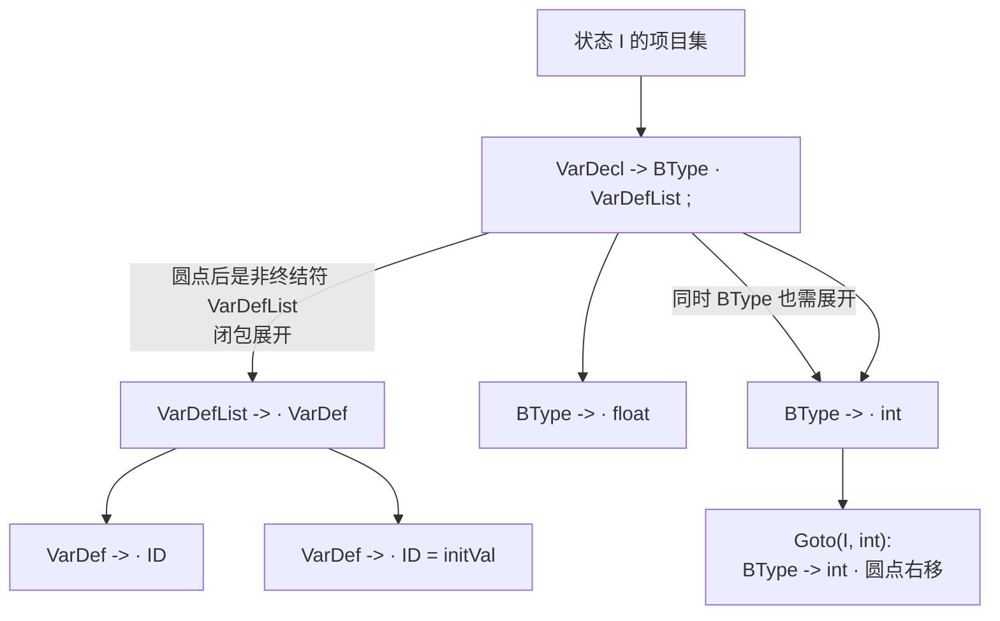

闭包保证：只要「期待 VarDefList」，就同时「期待 VarDef、ID…」；建表时才能正确填 Shift/Reduce。

#### 建表 `buildTable()`

1. 从 `Program -> · CompUnit` 出发，BFS 构造全部 LR 状态（本项目 **132 个状态**）
2. 对每个状态 I 和符号 X：
  - X 是终结符 → Action 表填 **Shift**（移进到新状态）
  - X 是非终结符 → Goto 表填状态转移
3. 若项目 `A -> α ·`（圆点在末尾）→ 对 `FOLLOW(A)` 中每个终结符 a，填 **Reduce A -> α**

#### 冲突处理

C 系语言的经典问题 **悬空 else（dangling else）**：`if (c) if (d) s1 else s2` 中，`else` 该归约内层 if 还是移进？

本项目在 `addAction()` 中 **移进优先**：

```cpp
// Syntax/SLRTable.cpp
if (existing.type == ACT_SHIFT && newAction.type == ACT_REDUCE) {
    return;  // 保留 Shift：else 与最近的 if 匹配
}
```

**dangling else 移进优先示意**：

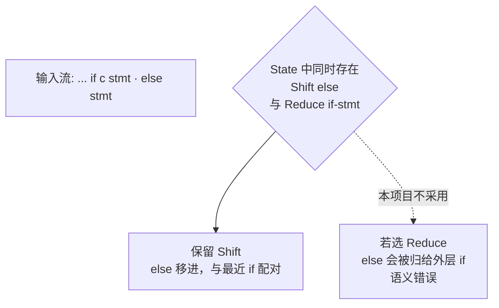

C 语言规定 **else 与最近 unmatched if 绑定**；SLR 遇到移进-归约冲突时，本项目强制保留 Shift（`SLRTable.cpp:248-252`）。

### 2.6 移进-归约分析驱动

Parser 维护两个栈：


| 栈            | 内容                |
| ------------ | ----------------- |
| `stateStack` | LR 状态编号           |
| `nodeStack`  | 语法树节点 `TreeNode*` |


**移进-归约双栈示意**（对应 `syntax1.txt` 前几步解析 `int main ( )`）：

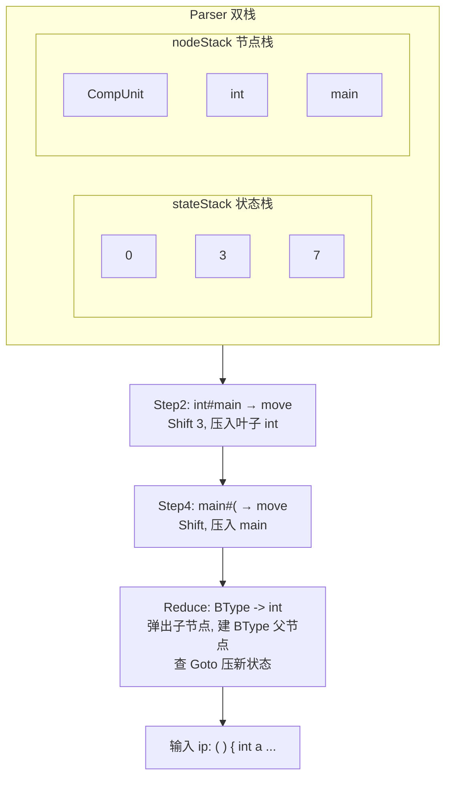

- **Shift**：状态栈压新状态，节点栈压 **终结符叶子**（如 `int`、`main`）
- **Reduce**：按产生式弹出 k 个状态/节点，节点栈压 **非终结符父节点**，再查 Goto 表

主循环逻辑（`Parser::parse()`）：

```cpp
while (true) {
    int currentState = stateStack.top();
    Token currentToken = tokens[ip];
    Action act = slrTable->actionTable[currentState][symbolId];

    if (act.type == ACT_SHIFT) {
        stateStack.push(act.target);
        nodeStack.push(new TreeNode(symbolId, currentToken.text, currentToken.line));
        ip++;  // 消费一个 Token
    }
    else if (act.type == ACT_REDUCE) {
        // 弹出 |β| 个状态/节点，反转子节点顺序
        // 创建非终结符节点，查 Goto 表压入新状态
    }
    else if (act.type == ACT_ACCEPT) {
        return nodeStack.top();  // 分析成功，返回根节点
    }
}
```

**归约时如何建树**（关键）：

```cpp
// 弹出产生式右部对应的节点
for (int i = 0; i < rightLen; i++) {
    stateStack.pop();
    children.push_back(nodeStack.top());
    nodeStack.pop();
}
reverse(children.begin(), children.end());  // 恢复正确顺序

TreeNode* innerNode = new TreeNode(prod.left, "", 0);
innerNode->children = children;
nodeStack.push(innerNode);
```

语法树节点定义：

```cpp
// Syntax/SyntaxTree.h
struct TreeNode {
    int symbolId;              // 符号 ID
    string text;               // 终结符原文（如 "a", "1", "if"）
    int line;
    vector<TreeNode*> children;
};
```

#### 词法 ERROR 的处理

若 Token 为 `<ERROR,行,列>`，Parser **打印错误并跳过**，继续分析后续 Token（`Parser.cpp:67-97`）。语法树基于「修正后的 Token 流」生成；若存在无法恢复的语法错误，则返回 `nullptr`，不输出 `treeN.txt`。

### 2.7 产物解读

#### 输入回顾：`lex1.txt` 片段

```
int	<KW,1>
main	<KW,5>
(	<SE,23>
...
int	<KW,1>
a	<IDN,a>
=	<OP,14>
1	<INT,1>
,	<SE,28>
b	<IDN,b>
```

语法器 **不读 `.sy` 源文件**，只读上述 Token 流。

#### 产物一：`syntax1.txt`（规约序列）

**格式**：`序号[TAB]栈顶符号#面临输入符号[TAB]动作`

```
1	unitList#int	reduction
2	int#main	move
3	bType#main	reduction
4	main#(	move
5	funcName#(	reduction
6	(#)	move
...
11	int#a	move
12	bType#a	reduction
13	a#=	move
14	=#1	move
15	1#,	move
```

**如何读一行** `13	a#=	move`：


| 字段     | 含义              |
| ------ | --------------- |
| `13`   | 第 13 步          |
| `a`    | 当前符号栈顶（刚移进的标识符） |
| `#`    | 分隔符             |
| `=`    | 下一个待读输入 Token   |
| `move` | **移进**：把 `=` 压栈 |


**动作类型**：


| 动作          | 含义         |
| ----------- | ---------- |
| `move`      | 移进（Shift）  |
| `reduction` | 归约（Reduce） |
| `accept`    | 接受，分析成功    |
| `error`     | 语法错误       |


以 `int a = 1 , b = 2 ;` 为例，规约序列中会看到：

1. 移进 `int`、`a`、`=`、`1`
2. 一系列 `reduction`：`1` → `Number` → `PrimaryExp` → … → `Exp` → `InitVal` → `VarDef`
3. 移进 `,`，再处理 `b = 2`
4. `VarDefList` 归约，最终 `VarDecl` → `Decl` → `BlockItem`

#### 产物二：`tree1.txt`（语法树）

解析成功后，以缩进形式打印 AST。以 `int a = 1 , b = 2 ;` 对应子树为例：

```
VarDecl
  BType
    int (int)
  VarDefList
    VarDef
      ID (a)
      = (=)
      InitVal
        Exp
          ...
            INT (1)
    , (,)
    VarDefList
      VarDef
        ID (b)
        = (=)
        InitVal
          ...
            INT (2)
  ; (;)
```

**`tree1.txt` 局部 AST 树形图**（与上方缩进文本等价，对应 `int a = 1 , b = 2 ;`）：

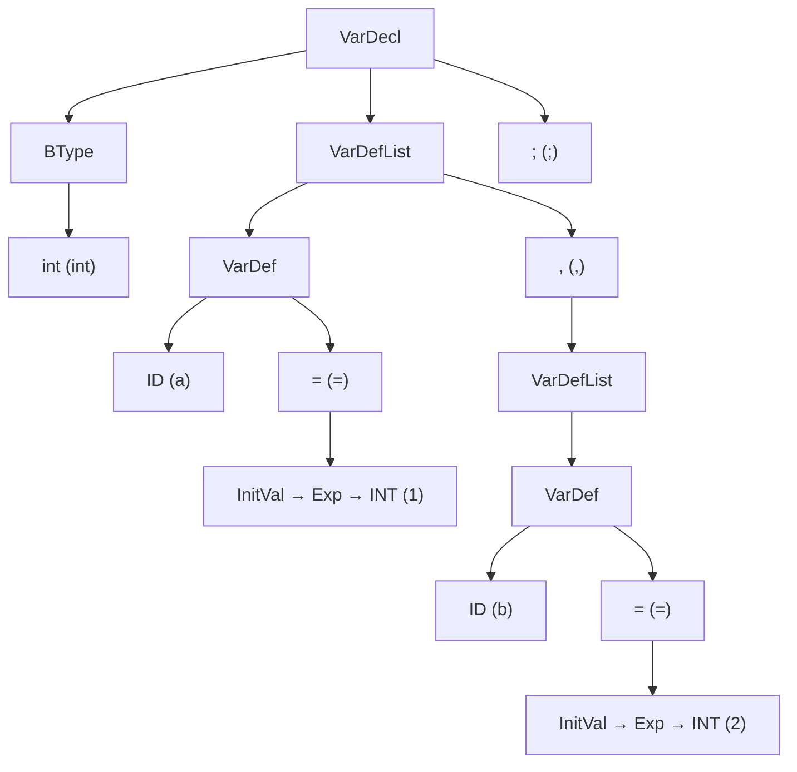

**读树的三条规则**：

1. **缩进 = 父子关系**：每多 2 个空格，就是更深一层子节点
2. **非终结符**：只有名字，如 `VarDecl`、`AddExp`——代表语法结构
3. **终结符**：`符号名 (原文)`，如 `ID (a)`、`INT (1)`——对应源程序中的实际 Token

`**AddExp` 下的加法**（`a = a + b - 1`）：

```
AddExp
  AddExp          ← 左操作数 a + b
    AddExp
      MulExp → ... → ID (a)
    + (+)
    MulExp → ... → ID (b)
  - (-)           ← 右结合通过树结构体现
  MulExp → ... → INT (1)
```

`**if-else` 子树**（`tree1.txt` 第 90 行起）：

```
Stmt
  if (if)
  ( (()
  Cond
    EqExp
      ... ID (a) == (==) INT (2)
  ) ())
  Stmt          ← then 分支
    Block → return 0
  else (else)
  Stmt          ← else 分支
    Block → b = b * 2 / 1 % 2; return 1
```

这棵树就是阶段三的输入：IR 生成器遍历 `VarDecl` 知道要分配变量，遍历 `EqExp` 知道要生成比较指令，遍历 `if/else` 知道要生成分支跳转。

#### 产物三：`1out.txt`（调试日志）

包含 FIRST/FOLLOW、完整 PARSING PROCESS 表（Step / State / Input / Action）、语法树副本。排查语法问题时 **优先看此文件**。

### 2.8 动手验证与常见坑

**前置**：确保已运行词法分析，存在 `lex/output/lex1.txt`。

```powershell
cd Syntax
g++ main.cpp GrammarAnalyzer.cpp SLRTable.cpp Parser.cpp ReductionSequenceLogger.cpp -o Syntaxer -std=c++17
./Syntaxer
# 默认读取 ../lex/output/lex1.txt
# 生成 output/1out.txt, syntax1.txt, tree1.txt
```

切换测试用例：修改 `main.cpp` 第 240 行 `lexFilename`。

**常见坑**：


| 现象                             | 可能原因                                |
| ------------------------------ | ----------------------------------- |
| `main` 被当成 ID 导致移进失败           | `mapTokenToSymbol` 未映射 `<KW,5>`     |
| `int a = 1 , b = 2` 在逗号处报错     | FOLLOW 集不完整；检查 VarDefList 展开        |
| if-else 分析冲突                   | SLR 移进-归约冲突未处理                      |
| 有 `syntax1.txt` 但无 `tree1.txt` | 分析中途语法错误，返回 nullptr                 |
| `<=` 解析 lex 行失败                | 应用 `rfind('<')` 从行尾解析，避免文本中的 `<` 干扰 |


### 2.9 阶段小结与下一阶段预告

**你应掌握**：

1. 语法分析把 Token 流校验为合法程序结构，并构建 AST
2. EBNF 必须展开为 CFG 才能用 SLR
3. FIRST/FOLLOW → LR 项目集 → Action/Goto 表 → 移进归约驱动
4. `syntaxN.txt` 记录分析过程，`treeN.txt` 是 IR 阶段的结构化输入

**下一阶段（中间代码生成）将回答**：

- 如何遍历 `tree1.txt` 重建 `TreeNode`？
- `visitVarDecl` 如何生成 `alloca` / `store`？
- `if (a == 2)` 如何变成 `icmp` + `br` 基本块？

---

## 阶段三：中间代码生成

> 阶段二的产物 `treeN.txt` 是本章输入；本章产出 `complie_ir/output/N.ll`（LLVM IR），是编译器前端对源程序语义的最终表示。

### 3.1 从语法树到中间代码

语法分析只回答「结构是否合法」。中间代码生成要回答：**程序在做什么？**

例如看到语法树中的 `VarDecl`，编译器需要分配内存；看到 `AddExp` 下的 `+`，需要生成加法指令；看到 `if-else`，需要生成分支跳转。

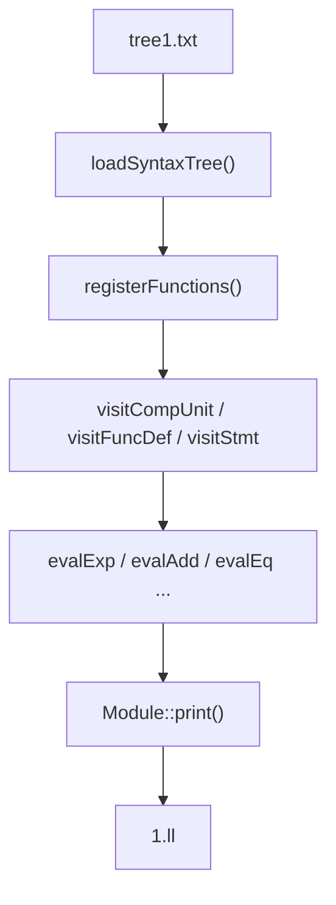


**与前一阶段的衔接**：

```
Syntax/output/tree1.txt  →  loadSyntaxTree()  →  IRGenerator::generate()  →  complie_ir/output/1.ll
```

IR 生成器 **不读** `.sy` 源文件，也不读 `lex1.txt`，只读语法树文本文件，在内存中重建 `TreeNode` 后遍历。

### 3.2 LLVM IR 基础概念

LLVM IR 是与机器无关的中间表示，本项目中端框架（`complie_ir/`）提供了构建 IR 的类：


| 概念          | 含义                     | 本项目类          |
| ----------- | ---------------------- | ------------- |
| Module      | 一个编译单元（类似一个 `.ll` 文件）  | `Module`      |
| Function    | 函数定义                   | `Function`    |
| BasicBlock  | 基本块：顺序执行的指令序列，以分支/返回结束 | `BasicBlock`  |
| Instruction | 单条 IR 指令               | `Instruction` |
| Value       | 指令结果、变量、常量等            | `Value`       |
| IRBuilder   | 向当前基本块插入指令             | `IRBuilder`   |


**本项目的变量策略**：局部变量用 `alloca` 在栈上分配，读写通过 `load`/`store`（而非纯 SSA 寄存器命名变量）。临时运算结果以 `%op1`、`%op2`… 编号。

**常见指令**（对照 `1.ll`）：


| IR 指令                                | 含义             |
| ------------------------------------ | -------------- |
| `%op = alloca i32`                   | 分配一个 i32 局部变量  |
| `store i32 1, i32* %op`              | 把 1 写入变量       |
| `%x = load i32, i32* %op`            | 从变量读出值         |
| `%y = add i32 %a, %b`                | 整数加法           |
| `%c = icmp eq i32 %x, 2`             | 比较相等，结果 i1（布尔） |
| `br i1 %c, label %then, label %else` | 条件分支           |
| `ret i32 0`                          | 返回             |


### 3.3 读取语法树：`loadSyntaxTree()`

语法分析器把 AST 导出为缩进文本；IR 阶段需要 **反向解析** 重建树。

规则与阶段二输出一致：

- 每 2 个空格 = 深一层
- `VarDecl` → 非终结符节点
- `ID (a)` → 终结符，`text = "a"`

```cpp
// complie_ir/src/IRmain.cpp
TreeNode *loadSyntaxTree(const string &filename, GrammarAnalyzer &ga) {
    auto symbolMap = buildSymbolIdMap(ga);  // 符号名 → SymbolType ID
    vector<pair<TreeNode *, int>> nodeStack;

    while (getline(file, line)) {
        int depth = indentSpaces / 2;
        // 解析 "ID (a)" → symbolName="ID", nodeText="a"
        TreeNode *node = new TreeNode(it->second, nodeText, lineNo);

        // 栈维护父子关系：弹出 depth >= 当前的节点，挂到栈顶
        while (!nodeStack.empty() && nodeStack.back().second >= depth)
            nodeStack.pop_back();
        nodeStack.back().first->children.push_back(node);
    }
    return root;
}
```

主程序流程（`IRmain.cpp`）：

1. 初始化文法（符号名映射需要）
2. `loadSyntaxTree(treeFilename, ga)`
3. `IRGenerator::generate(root, outputPath)`
4. `Module::print()` 写入 `.ll`

默认输入 `../Syntax/output/tree8.txt`，测试 `test1.sy` 时改为 `tree1.txt`。

### 3.4 IRGenerator 架构：Visitor + eval

`IRGenerator` 采用 **Visitor 模式**：按语法树节点的 `symbolId` 分发到不同处理函数。

```cpp
// complie_ir/include/IRGenerator.h
class IRGenerator {
    enum class ValueKind { INT, FLOAT, BOOL, VOID };

    struct VarInfo {
        Value *address;      // alloca 或 GlobalVariable
        ValueKind type;
        bool isConst, isGlobal;
    };

    struct ExprValue {
        Value *value;        // IR 值
        ValueKind type;
    };

    // visit*：处理声明、函数、语句（有副作用）
    void visitVarDecl(TreeNode *node, bool isGlobal);
    void visitFuncDef(TreeNode *node);
    void visitStmt(TreeNode *node);

    // eval*：处理表达式（返回值，按优先级分层）
    ExprValue evalExp(TreeNode *node);   // → evalLOr
    ExprValue evalAdd(TreeNode *node);   // + -
    ExprValue evalMul(TreeNode *node);   // * / %
    ExprValue evalEq(TreeNode *node);    // == !=
    // ...
};
```

**两套函数的分工**：


| 函数族                                                                                   | 对应 AST 节点 | 作用            |
| ------------------------------------------------------------------------------------- | --------- | ------------- |
| `visitProgram/CompUnit/Unit...`                                                       | 编译单元结构    | 遍历顶层声明与函数     |
| `visitDecl/VarDecl/ConstDecl`                                                         | 声明        | 分配变量、初始化      |
| `visitFuncDef/Block/Stmt`                                                             | 函数与语句     | 控制流、赋值、return |
| `evalLOr → evalLAnd → evalEq → evalRel → evalAdd → evalMul → evalUnary → evalPrimary` | 表达式层级     | 求值并生成运算指令     |


表达式链与文法优先级一致：`||` 最低，其次 `&&`，再 `==`/`!=`，关系运算，加减，乘除模，一元运算。

**Visitor 调用关系**（以 `test1.sy` 的 `main` 函数为例）：

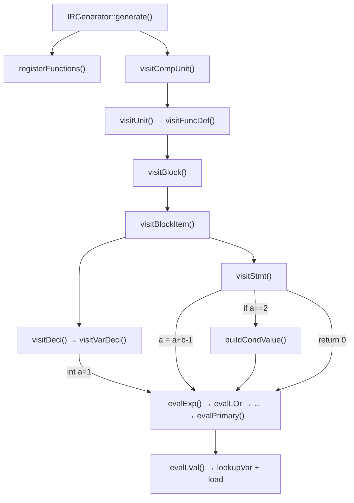

- `visit*`：按 **语句/声明结构** 遍历，有副作用（分配变量、建基本块）
- `eval*`：按 **表达式层级** 递归求值，返回 `ExprValue`（IR 的 `Value*`）

### 3.5 符号表与作用域

```cpp
unordered_map<string, VarInfo> globalVars_;           // 全局变量
vector<unordered_map<string, VarInfo>> scopeStack_;   // 局部作用域栈
unordered_map<string, FunctionInfo> functions_;       // 函数表
```

**查找规则** `lookupVar()`：从 `scopeStack_` 栈顶向下查，再查 `globalVars_`。

**作用域边界**：

- 进入函数体：`visitFuncDef` 中 `pushScope()`，参数 `alloca` + `defineLocal`
- 进入嵌套块：`visitBlock(isFunctionBody=false)` 再 `pushScope()`/`popScope()`
- 函数体块本身不重复 push（函数级作用域已建立）

**符号表 / 作用域栈示意**（`test1.sy` 在 `main` 内声明 `a, b`）：

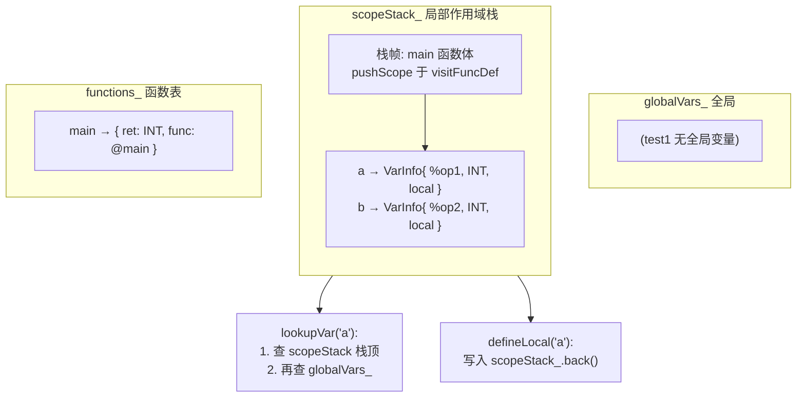

每个局部变量对应一次 `alloca`；`lookupVar` 先查当前作用域栈，再查全局表。

### 3.6 生成总控：`generate()`

```cpp
bool IRGenerator::generate(TreeNode *root, const std::string &outputPath) {
    module_ = std::make_unique<Module>("sysy2022_complier");
    builder_ = std::make_unique<IRBuilder>(nullptr, module_.get());

    registerFunctions(root);   // 第一遍：预注册所有函数签名
    visitCompUnit(root);       // 第二遍：生成 IR

    module_->set_print_name(); // 给临时变量编号 %op1, %op2...
    ofs << module_->print();   // 输出 .ll 文件
}
```

**两遍扫描的原因**：函数 A 调用函数 B 时，需要先知道 B 的签名（返回类型、参数类型），才能在 IR 中生成正确的 `call` 指令。

### 3.7 变量声明：`visitVarDecl`

以 `int a = 1 , b = 2 ;` 对应的 `VarDecl` 子树为例：

**局部变量**（在 `main` 函数体内）：

```cpp
void IRGenerator::visitVarDecl(TreeNode *node, bool isGlobal) {
    ValueKind kind = parseBType(node->children[0]);  // int → ValueKind::INT
    collectVarDefs(node->children[1], defs);         // 收集 VarDef 列表

    for (auto *def : defs) {
        string name = parseIdent(def->children[0]);  // "a"
        auto allocaInst = builder_->create_alloca(getIRType(..., kind));
        defineLocal(name, {allocaInst, kind, false, false});

        if (hasInit) {
            ExprValue initVal = evalExp(def->children[2]->children[0]);
            builder_->create_store(initVal.value, allocaInst);
        }
    }
}
```

对应 `1.ll` 第 15–18 行：

```llvm
%op1 = alloca i32
store i32 1, i32* %op1
%op2 = alloca i32
store i32 2, i32* %op2
```

**全局变量**则用 `GlobalVariable::create`，写入 `@变量名 = global i32 ...`。

### 3.8 函数定义：`visitFuncDef`

```cpp
void IRGenerator::visitFuncDef(TreeNode *node) {
    // 解析返回类型、函数名、参数、Block
    auto *entry = BasicBlock::create(module_.get(), "main_ENTRY", currentFunction_);
    builder_->set_insert_point(entry);

    pushScope();
    // 参数：alloca + store + defineLocal
    visitBlock(blockNode, true);
    finalizeCurrentFunction();  // 若无 ret，补默认返回
    popScope();
}
```

`main` 函数入口基本块命名为 `main_ENTRY:`，与 `1.ll` 一致。

### 3.9 语句处理

#### 赋值 `a = a + b - 1`

`visitStmt` 识别 `LVal = Exp ;` 结构：

```cpp
if (c[0]->symbolId == NON_LVAL && c.size() >= 4) {
    auto rhs = evalExp(c[2]);           // 求右值
    handleAssignment(c[0], rhs);        // store 到变量
}
```

`evalAdd` 处理加法/减法，`evalMul` 处理乘除模。`a + b - 1` 在树上体现为左结合的 `AddExp` 嵌套，生成：

```llvm
%op3 = load i32, i32* %op1    ; a
%op4 = load i32, i32* %op2    ; b
%op5 = add i32 %op3, %op4     ; a + b
%op6 = sub i32 %op5, 1        ; - 1
store i32 %op6, i32* %op1     ; a = ...
```

#### 条件 `if ( a == 2 )`

`buildCondValue()` 从 `Cond → LOrExp` 求出 i1 布尔值：

```cpp
if (c[0]->symbolId == SYM_KW_IF) {
    auto condVal = buildCondValue(c[2]);  // icmp eq ...
    int labelId = ifLabelCounter_++;
    auto *thenBB = BasicBlock::create(..., "if_then" + to_string(labelId), ...);
    auto *elseBB = BasicBlock::create(..., "if_else" + to_string(labelId), ...);

    builder_->create_cond_br(condVal, thenBB, elseBB);
    builder_->set_insert_point(thenBB);
    visitStmt(c[4]);   // then 分支
    // else 分支 ...
}
```

`evalEq` 生成 `icmp eq`：

```cpp
cmp = builder_->create_icmp_eq(lhs.value, rhs.value);
return {cmp, ValueKind::BOOL};
```

对应 `1.ll` 第 24–35 行：

```llvm
%op7 = load i32, i32* %op1
%op8 = icmp eq i32 %op7, 2
br i1 %op8, label %if_then0, label %if_else0
if_then0:
    ret i32 0
if_else0:
    ; b = b * 2 / 1 % 2
    %op11 = load i32, i32* %op2
    %op12 = mul i32 %op11, 2
    %op13 = sdiv i32 %op12, 1
    %op14 = srem i32 %op13, 2
    store i32 %op14, i32* %op2
    ret i32 1
```

**`test1.sy` 控制流图 CFG**（与 `1.ll` 基本块一一对应）：

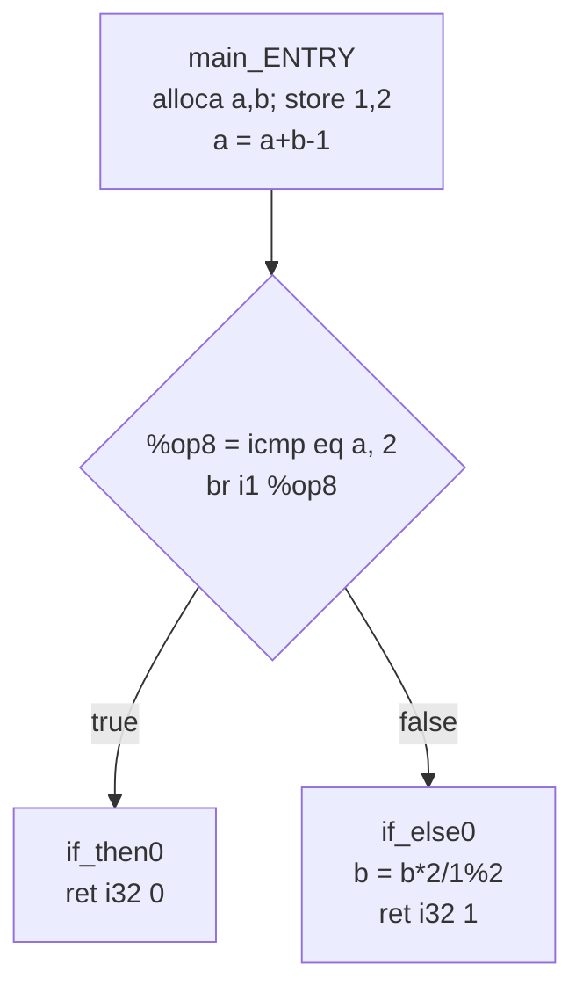

源程序片段与基本块对应：

| 源程序 | IR 基本块 / 指令 |
|--------|------------------|
| `int a=1, b=2; a=a+b-1;` | `main_ENTRY`：`alloca`、`store`、`add`、`sub` |
| `if (a == 2)` | `icmp eq` + `br i1` |
| `{ return 0; }` | `if_then0`：`ret i32 0` |
| `{ b=...; return 1; }` | `if_else0`：`mul/sdiv/srem`、`ret i32 1` |

注意：本例 then/else 分支都以 `ret` 结束，因此 **不生成 `if_merge` 合并块**——两个分支各自返回，函数在此结束。

#### `return`

```cpp
if (c[0]->symbolId == SYM_KW_RETURN) {
    retVal = evalExp(c[1]->children[0]);
    builder_->create_ret(retVal.value);  // ret i32 0
}
```

### 3.10 表达式求值链

以 `evalAdd` 为例，递归结构对应 AST 左递归产生式 `AddExp → AddExp + MulExp`：

```cpp
ExprValue IRGenerator::evalAdd(TreeNode *node) {
    if (node->children.size() == 1)
        return evalMul(node->children[0]);   // 递归到底
    auto lhs = evalAdd(node->children[0]);   // 左子树
    auto rhs = evalMul(node->children[2]);   // 右子树
    res = builder_->create_iadd(lhs.value, rhs.value);
    return {res, lhs.type};
}
```

**左值求值** `evalLVal`：查符号表 → `load`：

```cpp
VarInfo *info = lookupVar(name);
loaded = builder_->create_load(info->address);
return {loaded, info->type};
```

**逻辑运算** `&&` / `||`：本项目将两边转为整数后做 `iadd`/`imul`，再与 0 比较（短路语义未做优化，但结果正确）。

### 3.11 产物解读：`1.ll` 全文对照

以 `test1.sy` 完整走读 `complie_ir/output/1.ll`：

```llvm
; ModuleID = 'sysy2022_complier'
source_filename = "./input/1.sy"

declare i32 @getinit()      ; 框架预置的运行库声明
; ... 共 8 个 declare

define i32 @main() {
main_ENTRY:
    ; int a = 1, b = 2;
    %op1 = alloca i32
    store i32 1, i32* %op1
    %op2 = alloca i32
    store i32 2, i32* %op2

    ; a = a + b - 1;
    %op3 = load i32, i32* %op1
    %op4 = load i32, i32* %op2
    %op5 = add i32 %op3, %op4
    %op6 = sub i32 %op5, 1
    store i32 %op6, i32* %op1

    ; if (a == 2) { return 0; } else { b = ...; return 1; }
    %op7 = load i32, i32* %op1
    %op8 = icmp eq i32 %op7, 2
    br i1 %op8, label %if_then0, label %if_else0
if_then0:
    ret i32 0
if_else0:
    %op11 = load i32, i32* %op2
    %op12 = mul i32 %op11, 2
    %op13 = sdiv i32 %op12, 1
    %op14 = srem i32 %op13, 2
    store i32 %op14, i32* %op2
    ret i32 1
}
```

**源程序 → IR 映射表**：


| 源程序                                   | 语法树节点                                       | IR                               |
| ------------------------------------- | ------------------------------------------- | -------------------------------- |
| `int a = 1`                           | `VarDecl → VarDef → InitVal → Exp → INT(1)` | `alloca` + `store i32 1`         |
| `a = a + b - 1`                       | `Stmt → LVal = Exp`                         | `load` + `add` + `sub` + `store` |
| `a == 2`                              | `Cond → EqExp`                              | `load` + `icmp eq`               |
| `if (...) { return 0; } else { ... }` | `Stmt → if Cond Stmt else Stmt`             | `br` + 两个基本块 + `ret`             |


### 3.12 动手验证与常见坑

**前置**：语法分析已成功生成 `Syntax/output/tree1.txt`。

```powershell
cd complie_ir
# 修改 src/IRmain.cpp 第 170 行：treeFilename = "../Syntax/output/tree1.txt"
mkdir build; cd build
cmake ..
cmake --build .
./project1.exe   # 或 ../IRmain.exe
# 输出 complie_ir/output/1.ll
```

**验证 IR 语法**（需安装 LLVM）：

```powershell
llvm-as complie_ir/output/1.ll   # 无输出即成功
clang complie_ir/output/1.ll -o test1.exe
```

**无 LLVM 时的手动检查**：

- 以 `; ModuleID` 开头，含 `source_filename`
- 函数以 `define` 开头、以 `}` 结尾
- 每个基本块有标签，指令格式 `%opN = 操作码 类型, 操作数`
- 每个函数路径以 `ret` 结束

**常见坑**：


| 现象                       | 可能原因                                |
| ------------------------ | ----------------------------------- |
| `Unknown symbol 'XXX'`   | tree 文件符号名与文法 `getSymbolName` 不一致   |
| `Undefined identifier a` | 变量未 `defineLocal` 或作用域 pop 过早       |
| `Return type mismatch`   | void 函数有返回值，或 int 函数 return 了 float |
| 树加载成功但 IR 为空             | root 节点类型不是 `CompUnit`/`Program`    |
| `%op` 编号乱序               | 忘记调用 `module_->set_print_name()`    |


### 3.13 三阶段串联回顾

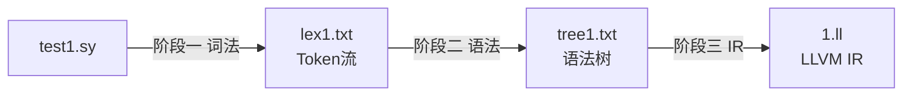


| 阶段  | 核心问题    | 关键算法/模式            | 产物                          |
| --- | ------- | ------------------ | --------------------------- |
| 词法  | 如何切分单词？ | NFA→DFA，最长匹配       | `lexN.txt`                  |
| 语法  | 结构是否合法？ | SLR 移进-归约          | `syntaxN.txt` + `treeN.txt` |
| IR  | 程序做什么？  | Visitor + eval，符号表 | `N.ll`                      |


**你应掌握**：

1. IR 生成遍历 AST，而非重新解析源程序
2. `visit`* 处理语句/声明（副作用），`eval*` 处理表达式（返回值）
3. 局部变量 `alloca`+`load`/`store`；控制流 `br`+基本块
4. 对照 `tree1.txt` 节点与 `1.ll` 指令，理解语法制导翻译

---

## 附录

项目github完整地址：[islets100/C--Compiler: 一个“miniC”语言的编译器前端——2022年编译器设计赛赛题。包含词法、语法解析器，语法树生成器，中间代码生成器](https://github.com/islets100/C--Compiler)

### 文法速查

完整 CFG 见仓库根目录 [c--文法.md](../c--文法.md)

### 测试用例索引

本项目实现提供了非常健全的语法和词法错误识别机制，你可以自行添加任何自定义的test文件，写任何语法错误！（bushi）
如果你想定位异常的原因，去找对应的日志文件out.txt，学习如何做链路追踪~


| 文件                  | 侧重                |
| ------------------- | ----------------- |
| `lex/test/test0.sy` | 词法错误字符            |
| `lex/test/test1.sy` | 算术、if-else（系列主示例） |
| `lex/test/test2.sy` | 浮点、void 函数等       |


